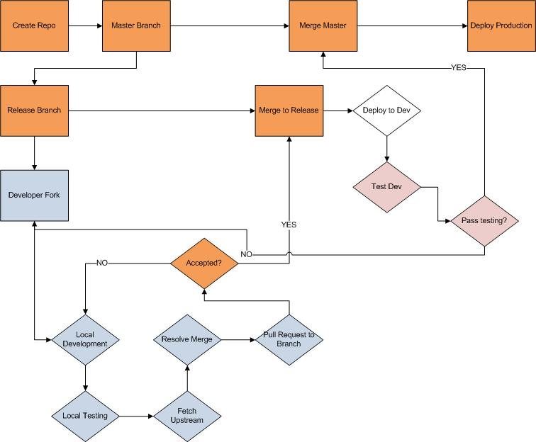

ForkingPractice
===============

Practice branching and forking 

This repo is to practice creating, manageing and working with forks and branches. Resources [Fork A Repo](https://help.github.com/articles/fork-a-repo)

How to work with this:

1. Click on the *Fork* button in the upper right. This will create a copy of the repo in your user account.
2. Clone your copy of the repo onto your computer:$git clone https://github.com/YOUR USER NAME/ForkingPractice.git
3. Configure remotes: 
	- $ git remote add upstream https://github.com/gtarnoff/ForkingPractice.git
	- $ git fetch upstream
	- Or use Tortoise to do this
3. Check out the release-1 branch.
4. Make modifications to the release-1 branch. 
6. Fetch the upstream and resolve merge issues.
5. Commit your changes to your fork of the repo.
6. You should now see a **Pull Request** button in Github now. Click it.
7. A notification will be sent to the owners to either accept or reject the pull request.
8. Once a pull request is accepted/rejected you should be notified. If it is rejected, you will need to resolve any issues and requbmit the pull.

##Notes:

* Feel free to commit to your fork as much as you want. My rule of thumb is tto only commit "working code" or "good code"
* Only make pull requests for "feature complete" user stories
* All pull requests to Master will be rejected, so manage your release branches.

##Pretty Pictures

